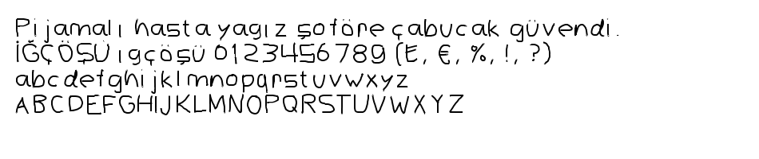

# OpenFont Studio (Piksel & Vektörel Font Editörü) 🎨🔤

[](https://opensource.org/licenses/OFL-1.1)
[](https://www.python.org/)
[](#)

Açık kaynak, modern, hem **serbest vektörel çizim** hem de **ayarlanabilir çözünürlüklü piksel grid** desteğine sahip interaktif bir TrueType font geliştirme stüdyosu.

Kendi el yazınızı, piksel fontunuzu veya tipografik tasarımınızı kolayca çizebilir; arka plandaki **şeffaf geometrik rehber şablon** yardımıyla harf oranlarını ve taban çizgisini kusursuz ayarlayabilir ve tek tıkla **TrueType (.ttf)** olarak indirip bilgisayarınızda veya **Samsung Galaxy S24 / Android** cihazınızda kullanabilirsiniz.

---

## 📸 Önizleme (Preview)



---

## ✨ Öne Çıkan Özellikler (Features)

1. **🎨 İnteraktif Çizim Tahtası (Drawing Board):**
   - **Vektörel Çizim Modu:** 1000×1000 UPM koordinat sisteminde serbest fırça, ayarlanabilir fırça kalınlığı (20..160px) ve silgi.
   - **Piksel Grid Modu:** İsteğe bağlı dinamik çözünürlük seçimi (**8×8**, **12×12**, **16×16**, **24×24**, **32×32**, **48×48**, **64×64**). Kalem, Silgi, Boya Kovası (Flood Fill), 4 yönlü kaydırma ve Ters Çevirme (Invert).
   - **Modlar Arası Dönüştürme:** Piksel grid'i vektör kutularına çevirme veya vektörü piksel grid'e otomatik rasterize etme.

2. **👻 Şeffaf Arkaplan Rehberi (Ghost Guide Template):**
   - Çizim yaparken neyi nereye çizeceğinizi, taban çizgisini (baseline), x-yüksekliğini ve harf oranlarını gösteren **silik geometrik kılavuz şablon**.
   - Tek tıkla açılıp kapatılabilir, şeffaflığı (%5 - %60) kaydırıcı ile ayarlanabilir.
   - **TTF çıktısına asla karışmaz;** fontu derlediğinizde yalnızca sizin çizimleriniz dosyaya aktarılır.

3. **🗑️ Hızlı Temizleme & Geri Alma:**
   - **Tüm Çizimleri Temizle:** 113 karakterin tamamındaki çizimleri tek tıkla silip boş tuval açar (şeffaf rehber arkada kalır).
   - **Bu Harfi Sil:** Yalnızca seçili harfi temizler.
   - **Geri Al (Undo):** `Ctrl+Z` veya buton ile son 30 adımı geri alma.

4. **🇹🇷 Tam Türkçe Alfabe & Zengin Karakter Seti (113 Glyphs):**
   - **Türkçe Büyük Harfler:** `A B C Ç D E F G Ğ H I İ J K L M N O Ö P Q R S Ş T U Ü V W X Y Z`
   - **Türkçe Küçük Harfler:** `a b c ç d e f g ğ h ı i j k l m n o ö p q r s ş t u ü v w x y z`
   - **Rakamlar:** `0 1 2 3 4 5 6 7 8 9`
   - **Noktalama & Semboller:** `! " # $ % & ' ( ) * + , - . / : ; < = > ? @ [ \ ] ^ _ ` { | } ~`
   - **Para & Özel Simgeler:** `₺` (Türk Lirası), `€` (Euro), `£` (Sterlin), `°` (Derece)

5. **👁️ Canlı Tipografi Testi & Anında Derleme:**
   - Türkçe pangramlar ve metinlerle tarayıcı içinde anında canlı önizleme.
   - **"⚡ TTF Derle & İndir"** butonu ile sıfır gecikmeyle standart TrueType (`.ttf`) derleme.

---

## 🛠️ Hızlı Başlangıç (Quickstart)

### 1. Depoyu Klonlayın ve Bağımlılıkları Yükleyin

```bash
# Depoyu klonlayın
git clone https://github.com/yavuz/openfont-studio.git
cd openfont-studio

# Python sanal ortamı oluşturun ve aktifleştirin
python -m venv .venv

# Windows:
.venv\Scripts\activate

# macOS / Linux:
# source .venv/bin/activate

# Gerekli kütüphaneleri yükleyin
pip install -r requirements.txt
```

### 2. Web Editörünü Başlatın

```bash
python builder/font_editor.py
```

Tarayıcınızda **`http://localhost:5000`** adresini açın.

### 3. Komut Satırından Doğrudan TTF Derleme

```bash
python builder/build_font.py
```

Derlenen font `output/OpenPixelFont-Regular.ttf` içerisine kaydedilir.

---

## 📱 Galaxy S24 ve Android Cihazlara Yükleme Rehberi

Kendi tasarladığınız fontu Samsung Galaxy S24 veya herhangi bir Android cihazda sistem fontu olarak kullanmak için:

1. Web stüdyosundaki **"⚡ TTF Derle & İndir"** butonuna basarak `.ttf` dosyanızı indirin.
2. Dosyayı telefonunuza aktarın (`İndirilenler` / `Downloads` klasörü).
3. Google Play Store'dan **zFont 3** veya **MonoFont** uygulamasını yükleyin.
4. **zFont 3** uygulamasında:
   - En alttaki **Local** sekmesine geçin ve **"+"** butonuna basarak indirdiğiniz `.ttf` dosyasını seçin.
   - **Apply (Uygula) -> Auto (Samsung One UI)** seçeneğini işaretleyin.
   - Ekranda gösterilen 8 kolay adımı tamamlayın (Samsung Sans yükle -> Kendi fontunu uygula -> Yedekleme/Geri Yükleme).
5. Artık telefonunuz tamamen sizin el yazınız veya tasarımınızla çalışacaktır! 🎉

---

## 📁 Proje Dizin Yapısı (Project Structure)

```
.
├── glyphs/                 # 113 karakterin JSON veri dosyaları (Unicode, Genişlik, Vektör, Grid)
│   ├── _metadata.json      # Font global metrikleri (UPM 1000, Ascender 800, Baseline 0, vb.)
│   ├── U0041.json          # 'A' harfi
│   ├── U00C7.json          # 'Ç' harfi
│   ├── U20BA.json          # '₺' simgesi
│   └── ...
├── builder/                # Derleme Motoru & Sunucu
│   ├── build_font.py       # Çoklu çözünürlüklü Vektör & Grid TrueType derleyici
│   ├── font_editor.py      # Flask REST API sunucusu
│   └── geometric_builder.py# Geometrik referans şablon üreticisi
├── web/                    # Modern Stüdyo Web Arayüzü
│   ├── editor.html         # Çizim tahtası, fırça araçları, canlı test alanı
│   └── ghost_templates.json# Arka plan şeffaf rehber şablon verisi
├── output/                 # Derlenen .ttf ve örnek önizleme görselleri
│   ├── OpenPixelFont-Regular.ttf
│   └── preview.png
├── docs/                   # Dokümantasyon ve Katkı Rehberi
│   └── CONTRIBUTING.md
├── .github/workflows/      # GitHub Actions CI/CD otomatik derleme
│   └── build.yml
├── .gitignore              # Git tarafından yok sayılacak dosyalar
├── requirements.txt        # Python bağımlılıkları (fonttools, flask, pillow)
├── LICENSE                 # SIL Open Font License 1.1
└── README.md
```

---

## 🤝 Katkıda Bulunma (Contributing)

Katkılarınızı memnuniyetle kabul ediyoruz!
1. Bu depoyu Fork'layın.
2. Yeni bir dal (branch) açın: `git checkout -b feature/harika-ozellik`
3. Değişikliklerinizi commit'leyin: `git commit -m 'feat: yeni fırça aracı eklendi'`
4. Dalınıza push yapın: `git push origin feature/harika-ozellik`
5. Bir **Pull Request** açın.

Detaylar için [CONTRIBUTING.md](docs/CONTRIBUTING.md) dosyasına göz atabilirsiniz.

---

## 📜 Lisans (License)

Bu proje **[SIL Open Font License 1.1](LICENSE)** ile lisanslanmıştır. Fontları ve stüdyo kodlarını özgürce kullanabilir, değiştirebilir ve ticari veya kişisel projelerinizde paylaşabilirsiniz.
